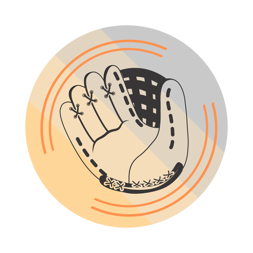
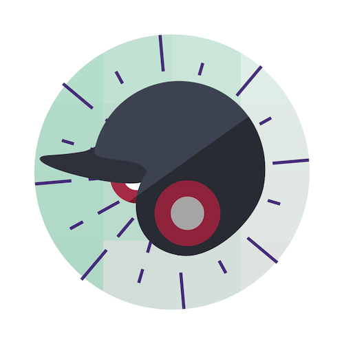
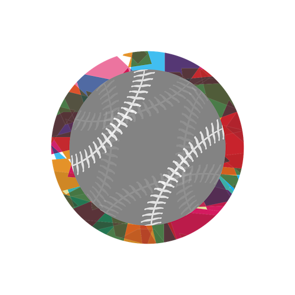
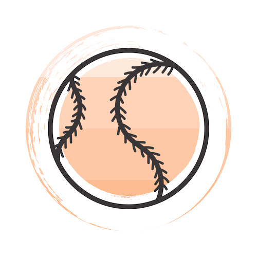
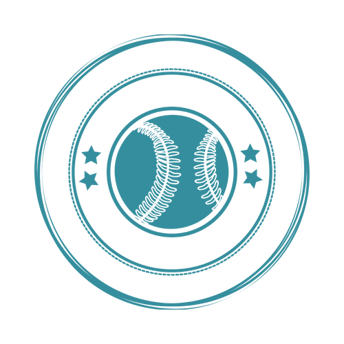
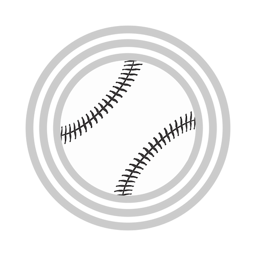
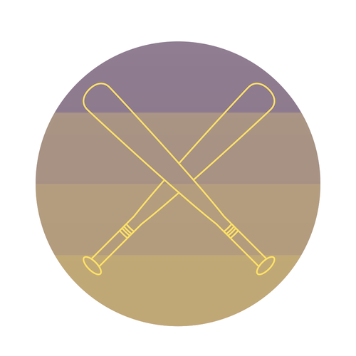
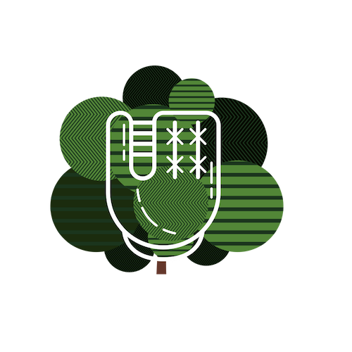

<!-- Image -->
<!--
<section class="image fit">
	<section>
	

	</section>
	<section>
	

	</section>
	<section>
	

	</section>
	
	<section>
	

	</section>
	<section>
	

	</section>
	<section>
	

	</section>
	
	<section>
	

	</section>
	<section>
	

	</section>
	

	</section> -->

		
| | |
|--|--|--|
|  |  **Team**: The Balking Dead  **Location**: Sacramento, CA  **League Best**: 3rd, 2018  **MLB Team**:  Oakland A's  **Street Name**: Josh |

| | |
|--|--|--|
|  | **Team**: Team Smitha  **Location**: Seattle, WA  **League Best**: 1st, 2015 (legacy)  **MLB Team**:  SF Giants  **Street Name**: Nate

| | |
|--|--|--|
|  |  **Team**: Team Ready to Win  **Location**: Sacramento, CA  **League Best**: 1st, 2018  **MLB Team**:  Oakland A's  **Street Name**: Amanda |

| |  |
|--|--|--|
|  |  **Team**: Team Warren  **Location**: Tempe, AZ  **League Best**: 3rd, 2016  **MLB Team**:  Seattle Mariners  **Street Name**: Andy |

| |  |
|--|--|--|
|  |  **Team**: Good King Wenceslas  **Location**: Seattle, WA  **League Best**: 1st, 2016  **MLB Team**:  Seattle Mariners  **Street Name**: Jake|

| |  |
|--|--|--|
|  |  **Team**: Oh Oh Oh Tani  **Location**: Seattle, WA  **League Best**: 2nd, 2018  **MLB Team**:  Seattle Mariners  **Street Name**: Sean|

| |  |
|--|--|--|
|  |  **Team**: A Team Has No Name  **Location**: Washington, DC  **League Best**: 1st, 2017  **MLB Team**:  Seattle Mariners  **Street Name**: Nichole |

| |  |
|--|--|--|
|  |  **Team**: King In The East?  **Location**: Washington, DC  **League Best**: 2nd, 2017  **MLB Team**:  Seattle, WA  **Street Name**: Ryan |

| | |
|--|--|--|
|  | **Team**: Lil Haynes  **Location**: Seattle, WA   **League Best**: NA   **MLB Team**:  SF Giants   **Street Name**: Kevin |

| | |
|--|--|--|
|  | **Team**: Mad Bummer  **Location**: Seattle, WA   **League Best**: 2nd, 2016   **MLB Team**:  SF Giants   **Street Name**: Yesi |
