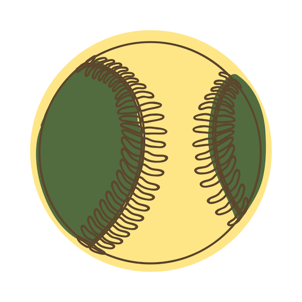

<!-- Image -->

	

		

		<!-- Nate -->
			
<h3>Smitha</h3>

			
			
			<a class="icon alt fa-map-marker" target="_blank">Seattle, WA</a>
			  <b>League Best:</b> 1st, 2015
			  <b>MLB Team:</b> SF Giants
			  <b>Street Name:</b> Nate
			 
			
		

		<!-- Amanda -->
		

			
<h3>Ready to Win</h3>

			
			
			<b>Location:</b> Sacramento, CA
			  <b>League Best:</b> 1st, 2018
			  <b>MLB Team:</b> Oakland A's
			  <b>Street Name:</b> Amanda
			 
			
		

		<!-- Wild -->
		

			
<h3>Good King Wenceslas</h3>

			
			
			<b>Location:</b> Seattle, WA
			  <b>League Best:</b> 1st, 2016
			  <b>MLB Team:</b> Seattle Mariners
			  <b>Street Name:</b> Jake
			 
			
		

		<!-- Sean -->
		

			
<h3>Oh Oh Oh Tani </h3>

			
			
			<b>Location:</b> Seattle, WA
			  <b>League Best:</b> 2nd, 2018
			  <b>MLB Team:</b> Seattle Mariners
			  <b>Street Name:</b> Sean
			 
			
		

		<!-- Josh -->
		

			
<h3>The Balking Dead</h3>

			
			
			<b>Location:</b> Sacramento, CA
			  <b>League Best:</b> 3rd, 2018
			  <b>MLB Team:</b> Oakland A's
			  <b>Street Name:</b> Josh
			 
			
		

		<!-- Ryan -->
		

			
<h3>King In The East?</h3>

			
			
			<b>Location:</b> Washington, DC
			  <b>League Best:</b> 2nd, 2017
			  <b>MLB Team:</b> Seattle Mariners
			  <b>Street Name:</b> Ryan
			 
			
		

	

<!-- SECOND SET -->

	

		<!-- Kevin -->
		

			
<h3>Lil' Haynes</h3>

			
			
			<b>Location:</b> Redmond, WA
			  <b>League Best:</b> NA
			  <b>MLB Team:</b> Seattle Mariners
			  <b>Street Name:</b> Kevin
			 
			
		

		<!-- Yesi -->
		

			
<h3>Mad Bummer</h3>

			
			
			<b>Location:</b> Seattle, WA
			  <b>League Best:</b> 2nd, 2016
			  <b>MLB Team:</b> SF Giants
			  <b>Street Name:</b> Yesi
			 
			
		

		<!-- Nichole -->
		

			
<h3>Team Has No Name</h3>

			
			
			<b>Location:</b> Seattle, WA
			  <b>League Best:</b> 1st, 2017
			  <b>MLB Team:</b> Seattle Mariners
			  <b>Street Name:</b> Nichole
			 
			
		

		<!-- Andy -->
		

			
<h3>Warren</h3>

			
			
			<b>Location:</b> Tempe, AZ
			  <b>League Best:</b> 3rd, 2016
			  <b>MLB Team:</b> Seattle Mariners
			  <b>Street Name:</b> Andy
			 
			
		

	

