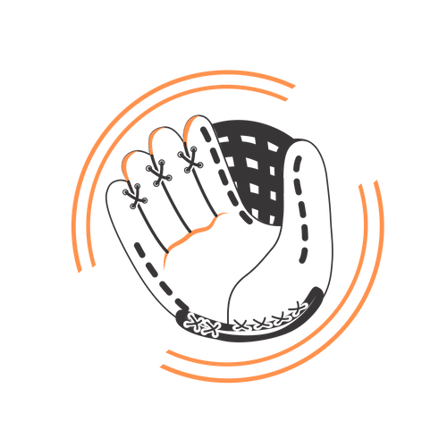

<!-- Image -->

	

		

		<!-- Nate -->
		
<h3>Smitha</h3>

			<!-- -->
			
			<a class="icon alt fa-map-marker" >...... Seattle, WA</a>  
			  <a class="icon alt fa-trophy">..... 1st, 2015</a>  
			  <a class="icon alt fa-thumbs-o-up">...... SF Giants</a>  
			  <a class="icon alt fa-user">..... Nate</a>  
			 
			

		

		<!-- Amanda -->
		

			
<h3>Ready to Win</h3>

			<!-- -->
			
			<a class="icon alt fa-map-marker" > Sacramento, CA</a>
			  <a class="icon alt fa-trophy"> 1st, 2018</a>
			  <a class="icon alt fa-thumbs-o-up"> Oakland A's</a>
			  <a class="icon alt fa-user"> Amanda</a>
			 
			
		

		<!-- Wild -->
		

			
<h3>Good King Wenceslas</h3>

			<!--  -->
			
			<a class="icon alt fa-map-marker" > Seattle, WA</a>
			  <a class="icon alt fa-trophy"> 1st, 2016</a>
			  <a class="icon alt fa-thumbs-o-up"> Seattle Mariners</a>
			  <a class="icon alt fa-user"> Jake</a>
			 
			
		

		<!-- Sean -->
		

			
<h3>Oh Oh Oh Tani </h3>

			<!--  -->
			
			<a class="icon alt fa-map-marker" > Seattle, WA</a>
			  <a class="icon alt fa-trophy"> 2nd, 2018</a>
			  <a class="icon alt fa-thumbs-o-up"> Seattle Mariners</a>
			  <a class="icon alt fa-user"> Sean</a>
			 
			
		

		<!-- Josh -->
		

			
<h3>The Balking Dead</h3>

			<!--  -->
			
			<a class="icon alt fa-map-marker" > Sacramento, CA</a>
			  <a class="icon alt fa-trophy"> 3rd, 2018</a>
			  <a class="icon alt fa-thumbs-o-up"> Oakland A's</a>
			  <a class="icon alt fa-user"> Josh</a>
			 
			
		

		<!-- Ryan -->
		

			
<h3>King In The East?</h3>

			<!--  -->
			
			<a class="icon alt fa-map-marker" > Washington, DC</a>
			  <a class="icon alt fa-trophy"> 2nd, 2017</a>
			  <a class="icon alt fa-thumbs-o-up"> Seattle Mariners</a>
			  <a class="icon alt fa-user"> Ryan</a>
			 
			
		

		<!-- Kevin -->
		

			
<h3>Lil' Haynes</h3>

			<!--  -->
			
			<a class="icon alt fa-map-marker" > Redmond, WA</a>
			  <a class="icon alt fa-trophy"> NA</a>
			  <a class="icon alt fa-thumbs-o-up"> Seattle Mariners</a>
			  <a class="icon alt fa-user"> Kevin</a>
			 
			
		

		<!-- Yesi -->
		

			
<h3>Mad Bummer</h3>

			<!--  -->
			
			<a class="icon alt fa-map-marker" > Seattle, WA</a>
			  <a class="icon alt fa-trophy"> 2nd, 2016</a>
			  <a class="icon alt fa-thumbs-o-up"> SF Giants</a>
			  <a class="icon alt fa-user"> Yesi</a>
			 
			
		

		<!-- Nichole -->
		

			
<h3>Team Has No Name</h3>

			<!--  -->
			
			<a class="icon alt fa-map-marker" > Seattle, WA</a>
			  <a class="icon alt fa-trophy"> 1st, 2017</a>
			  <a class="icon alt fa-thumbs-o-up"> Seattle Mariners</a>
			  <a class="icon alt fa-user"> Nichole</a>
			 
			
		

		<!-- Andy -->
		

			
<h3>Warren</h3>

			<!--  -->
			
			<a class="icon alt fa-map-marker" > Tempe, AZ</a>
			  <a class="icon alt fa-trophy"> 3rd, 2016</a>
			  <a class="icon alt fa-thumbs-o-up"> Seattle Mariners</a>
			  <a class="icon alt fa-user"> Andy</a>
			 
			
		

	

<!--	

 -->

<!-- SECOND SET

	
 -->
