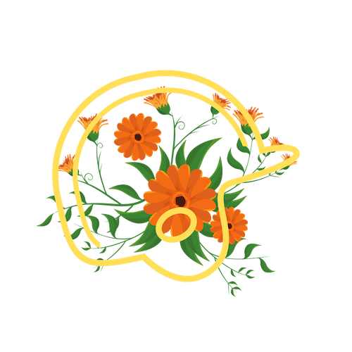

<!-- Image -->

	

		

		<!-- Nate -->
			
<h3>Smitha</h3>

			
			
			<b>Location:</b> Seattle, WA
			  <b>League Best:</b> 1st, 2015
			  <b>MLB Team:</b> SF Giants
			  <b>Street Name:</b> Nate
			
		

		<!-- Amanda -->
		

			
<h3>Ready to Win</h3>

			
			
			<b>Location:</b> Sacramento, CA
			  <b>League Best:</b> 1st, 2018
			  <b>MLB Team:</b> Oakland A's
			  <b>Street Name:</b> Amanda
			
		

		<!-- Wild -->
		

			
<h3>Good King Wenceslas</h3>

			
			
			<b>Location:</b> Seattle, WA
			  <b>League Best:</b> 1st, 2016
			  <b>MLB Team:</b> Seattle Mariners
			  <b>Street Name:</b> Jake
			
		

		<!-- Sean -->
		

			
<h3>Oh Oh Oh Tani </h3>

			
			
			<b>Location:</b> Seattle, WA
			  <b>League Best:</b> 2nd, 2018
			  <b>MLB Team:</b> Seattle Mariners
			  <b>Street Name:</b> Sean
			
		

		<!-- Josh -->
		

			
<h3>The Balking Dead</h3>

			
			
			<b>Location:</b> Sacramento, CA
			  <b>League Best:</b> 3rd, 2018
			  <b>MLB Team:</b> Oakland A's
			  <b>Street Name:</b> Josh
			
		

		<!-- Ryan -->
		

			
<h3>King In The East?</h3>

			
			
			<b>Location:</b> Washington, DC
			  <b>League Best:</b> 2nd, 2017
			  <b>MLB Team:</b> Seattle Mariners
			  <b>Street Name:</b> Ryan
			
		

		

		

		

		

	

<!-- table -->
<!--
| | |
|--|--|--|
|  |  **Team**: The Balking Dead  **Location**: Sacramento, CA  **League Best**: 3rd, 2018  **MLB Team**:  Oakland A's  **Street Name**: Josh |
| | |
|--|--|--|
|  | **Team**: Team Smitha  **Location**: Seattle, WA  **League Best**: 1st, 2015 (legacy)  **MLB Team**:  SF Giants  **Street Name**: Nate
| | |
|--|--|--|
|  |  **Team**: Team Ready to Win  **Location**: Sacramento, CA  **League Best**: 1st, 2018  **MLB Team**:  Oakland A's  **Street Name**: Amanda |
| |  |
|--|--|--|
|  |  **Team**: Team Warren  **Location**: Tempe, AZ  **League Best**: 3rd, 2016  **MLB Team**:  Seattle Mariners  **Street Name**: Andy |

|  |  **Team**: A Team Has No Name  **Location**: Washington, DC  **League Best**: 1st, 2017  **MLB Team**:  Seattle Mariners  **Street Name**: Nichole |

| | |
|--|--|--|
|  | **Team**: Lil Haynes  **Location**: Seattle, WA   **League Best**: NA   **MLB Team**:  SF Giants   **Street Name**: Kevin |
| | |
|--|--|--|
|  | **Team**: Mad Bummer  **Location**: Seattle, WA   **League Best**: 2nd, 2016   **MLB Team**:  SF Giants   **Street Name**: Yesi |
-->
